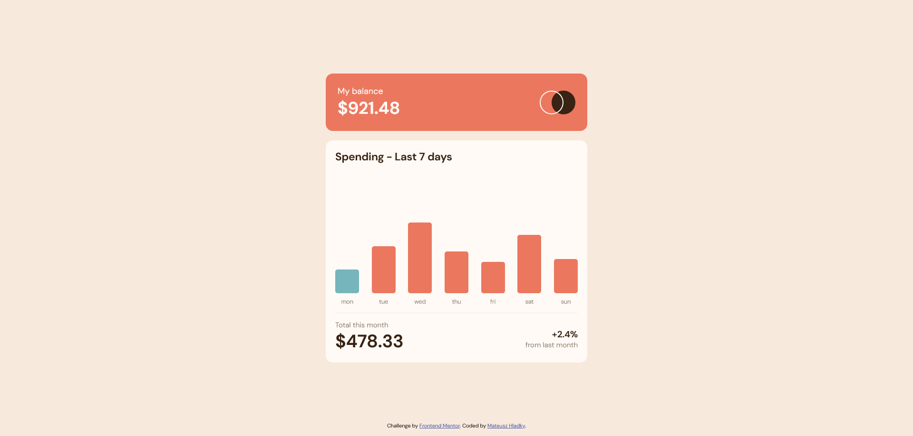

# Frontend Mentor - Expenses chart component solution

This is a solution to the [Expenses chart component challenge on Frontend Mentor](https://www.frontendmentor.io/challenges/expenses-chart-component-e7yJBUdjwt). Frontend Mentor challenges help you improve your coding skills by building realistic projects. 

## Table of contents

- [Overview](#overview)
  - [The challenge](#the-challenge)
  - [Screenshot](#screenshot)
  - [Links](#links)
- [My process](#my-process)
  - [Built with](#built-with)
  - [What I learned](#what-i-learned)
  - [Continued development](#continued-development)
  - [Useful resources](#useful-resources)
- [Author](#author)

## Overview

### The challenge

Users should be able to:

- View the bar chart and hover over the individual bars to see the correct amounts for each day
- See the current day’s bar highlighted in a different colour to the other bars
- View the optimal layout for the content depending on their device’s screen size
- See hover states for all interactive elements on the page
- **Bonus**: Use the JSON data file provided to dynamically size the bars on the chart

### Screenshot



### Links

- [Solution](https://www.frontendmentor.io/solutions/expenses-chart-component-a2gHTo4WYk)
- [Live Site](https://mateuszhladky.netlify.app/projects/expenses-chart-component)

## My process

### Built with

- Semantic HTML5
- CSS custom properties
- Flexbox
- Mobile-first workflow
- Vanilla JavaScript

### What I learned

I learned how to fetch data from json files and process them. I also used promises + async await for the first time in practise.

```js
async function fetchData() {
    const response = await fetch('./data.json');
    const data = await response.json();
    return data;
}

fetchData()
    .then(data => setData(data))
    .catch(error => {
        console.error(error);
    });

```
### Continued development

In the future I want to work on async JavaScript.

### Useful resources

- [JSON fetch solution](https://dmitripavlutin.com/javascript-fetch-async-await/#1-intro-to-fetch) - This helped me when I was trying to import JSON file into JS. I really liked this pattern and will use it going forward.

## Author

- Website - [Mateusz Hladky](https://mateuszhladky.netlify.app)
- Frontend Mentor - [@matibox](https://www.frontendmentor.io/profile/matibox)
- Twitter - [@m4t1box](https://www.twitter.com/m4t1box)
